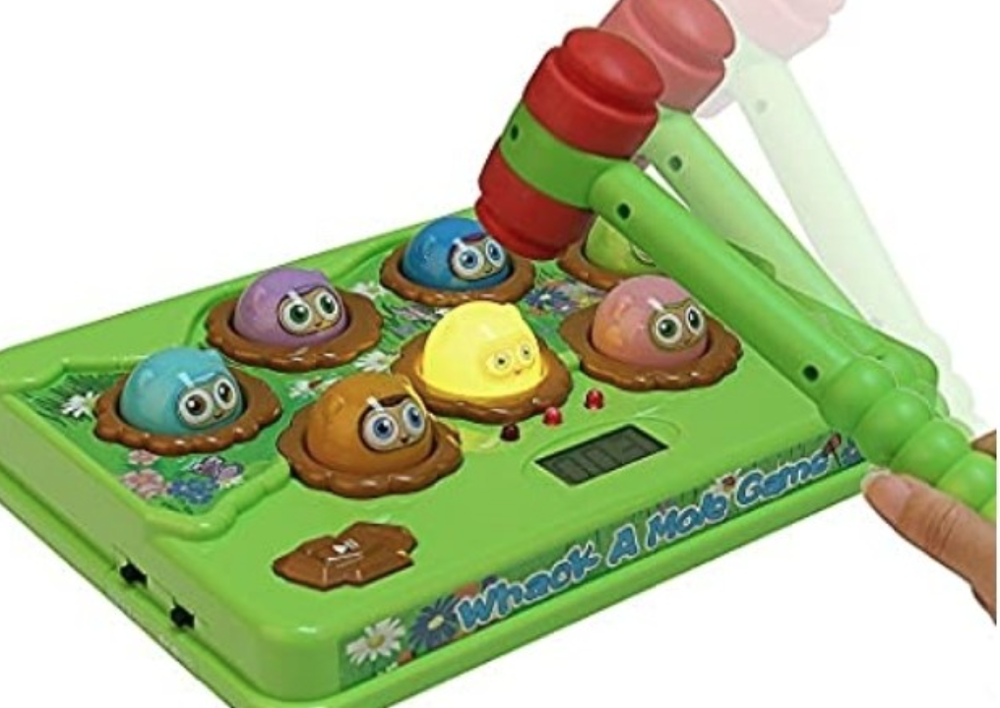
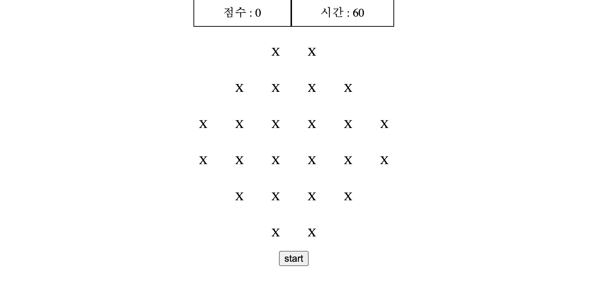
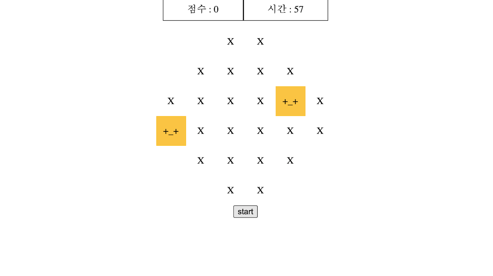

# 🕹 "Whac-A-Mole"

## 

1. Whenever user clicks "Start" button, game will be triggered.
2. "Mole" appears on the screen every 1~3 seconds.
3. The maximum number of moles can not be greater than 5 at the same time.
4. Whenever user catches a "mole", the container of mole changes.
5. If user catches a "mole", the score will be upgraded.
6. Game lasts for 60 seconds. Even though user reload pages, the timer should remain.

 

---

---

---

## 📝 About Details

## ⭐️ How game will be triggered ?

 

### When user clicks the "start button" the function _GameTrigger_ will be executed.

- By clicking button, timer will be decreased every one second.

* Timer will not be reset even though user clicks reload since the timer is saved on **local storage**.

* Every second, _gameTrigger_ will call _showMole_ function which is poping up moles on the screen.

   

---

---

---

 

## ⭐️ Display and catch moles on the screen !

- Moles will be displayed on the screen every one ~ three seconds.
- Whenever user clicks the mole, style of mole will be chnaged.
- The score will be increased when user catches the mole.
